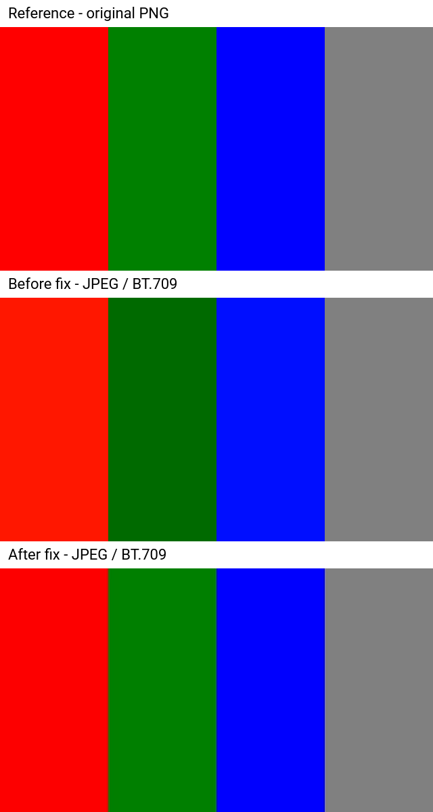

# BT.709 JPEG color conversion: reproduction and verification

Verification material for [remotion-dev/remotion#11331](https://github.com/remotion-dev/remotion/pull/11331). This is an independent, orphan branch containing only the reproduction, scripts, and results—not the Remotion source tree.

## Result

The old filter produces a visible color shift for JPEG frames rendered as BT.709. The new filter corrects it. For this RGB PNG reproduction, decoded pixels are unchanged across all 30 frames, although color metadata changes.



Videos: [JPEG before](results/jpeg-before.mp4) · [JPEG after](results/jpeg-after.mp4) · [PNG before](results/png-before.mp4) · [PNG after](results/png-after.mp4).

### Measured values

YUV samples at the center of the `#008000` green bar in the first decoded frame:

| Input | Filter | Y | U | V |
| --- | --- | --- | --- | --- |
| JPEG | Old | 80 | 91 | 81 |
| JPEG | New | 95 | 85 | 77 |
| PNG | Old | 95 | 85 | 77 |
| PNG | New | 95 | 85 | 77 |

- PNG decoded YUV was byte-identical before and after the change across all 30 frames. Both SHA-256 hashes are `57a8aca58204a0a71843d1b73e42f90f574aa219f71e892d171c77b11d91a1da`.
- All four outputs use `yuv420p`, TV/limited range, and a BT.709 matrix tag.
- New-filter outputs also report BT.709 primaries and transfer metadata. These fields are absent from the old-filter probe results. “PNG is unchanged” therefore applies to decoded pixels, not the entire file or all metadata.
- CLI renders matched the corresponding new-filter API renders across all decoded frames.
- The existing `packages/it-tests/src/ssr/color-space.test.ts` passed: one test, five assertions.

Full measurements, metadata, and decoded-frame hashes: [results.json](results/results.json).

## Minimal reproduction

Use [repro/color-repro.tsx](repro/color-repro.tsx) as an entry point in an existing Remotion project. It renders four solid bars: red, green, blue, and gray, at 640×360, 30 fps, for one second.

On a revision without the fix:

```bash
bunx remotion render color-repro.tsx ColorBars jpeg.mp4 \
  --codec=h264 --image-format=jpeg --color-space=bt709

bunx remotion render color-repro.tsx ColorBars png.mp4 \
  --codec=h264 --image-format=png --color-space=bt709
```

Compare both videos in the same player. The JPEG green bar is darker than the PNG reference. Repeat the JPEG render with #11331 applied to check the fix.

The expected result is approximately matching colors, allowing for JPEG/video compression and chroma subsampling. This explicitly selects BT.709; it does not depend on changing Remotion v4's default color space.

## How the attached results were generated

### Environment

- Linux x64
- Remotion repository version: `4.0.524`
- PR checkout: `ed2cb2f58a698357f22072636be5b4900c96f752`
- Node.js: `v24.15.0`
- Bun: `1.4.0`
- Chrome Headless Shell: `149.0.7790.0`
- Rendering and video decoding: Remotion's bundled FFmpeg `n7.1`
- System `/usr/bin/ffmpeg`: used to unpack decoded raw-video AVI files, extract comparison PNGs, and assemble the labeled comparison image

### Controlled old/new comparison

All four combinations of JPEG/PNG and old/new filters were rendered through the public `renderMedia()` API with H.264, BT.709, default CRF 18, and concurrency 2. A source PNG was also rendered with `renderStill()`.

**The before/after videos were not made using two separately installed npm releases.** Both used the PR checkout. `ffmpegOverride` restored exactly the old filter for the “before” renders and left the new filter in place for “after” renders. The script checks that the relevant filter was encountered exactly once per render, including when encoding runs in the pre-stitcher.

Old:

```text
zscale=matrix=709:matrixin=709:range=limited
```

New:

```text
zscale=matrix=709:range=limited:primariesin=709:primaries=709:transferin=709:transfer=709
```

The generated encoding arguments are preserved in `results/*-pre-stitcher-ffmpeg-args.json`. Temporary output paths in those files are historical, not inputs needed for reproduction.

### Analysis

[repro/analyze.py](repro/analyze.py):

1. Probes each MP4 using the bundled `ffprobe`.
2. Decodes all 30 frames to raw `yuv420p` in AVI using bundled FFmpeg.
3. Unpacks the raw payload without re-encoding using system FFmpeg.
4. Samples the center of each color bar and hashes all decoded frames.
5. Asserts identical PNG pixels, corrected JPEG green values, and the expected output metadata.
6. Extracts first-frame PNGs using the same FFmpeg pipeline for each video and builds `comparison.png`.

The montage is a visual aid. The raw YUV measurements independently establish that the problem is not merely a difference between player screenshots.

### Re-run the verification scripts

These scripts deliberately target a **prepared Remotion monorepo checkout**, not this orphan branch as a standalone application. Use the PR commit above, install dependencies with `bun install`, and build the packages with `bunx turbo run make`. The scripts require Linux x64, Python 3, `/usr/bin/ffmpeg` with `drawtext`, and Remotion's downloaded Chrome Headless Shell at the usual `node_modules/.remotion/chrome-headless-shell/linux64/` location.

From that prepared Remotion checkout, replace the first path with the location of this verification branch:

```bash
VERIFICATION_DIR=/path/to/remotion-bt709-verification
mkdir -p out
RUN_DIR=$(mktemp -d "$PWD/out/bt709-repro-XXXXXX")
cp "$VERIFICATION_DIR"/repro/* "$RUN_DIR/"
node "$RUN_DIR/verify.mjs"
python3 "$RUN_DIR/analyze.py"
```

The `out/<unique-directory>` layout matters: the scripts locate the Remotion checkout two levels above themselves. The scripts keep generated bundles, videos, raw decoded AVI files, images, and measurements in that directory. They do not change Remotion source files.

The CLI path was separately checked using the same entry point and options shown above, adding `--concurrency=2` and an explicit local `--browser-executable`. Its decoded output matched the corresponding API render.

The existing integration test was run from a prepared checkout with `packages/example/build` available:

```bash
cd packages/it-tests
bun test src/ssr/color-space.test.ts --timeout 120000
```

## Interpretation and limits

JPEG frames decode with a BT.601 matrix. Forcing `matrixin=709` interprets those values incorrectly rather than converting them to the BT.709 output matrix. Removing the override allows the actual input matrix to be used.

The PNG result supports keeping one filter path for the ordinary RGB PNG frames tested here. It is not a claim that arbitrary wide-gamut images, unusual transfer functions, other output codecs, or BT.2020 rendering have been validated.
